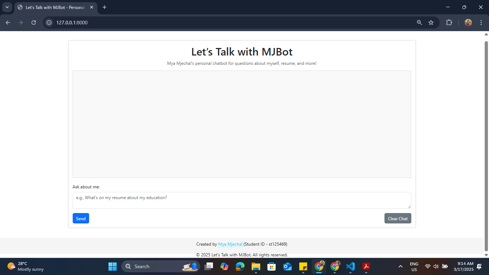
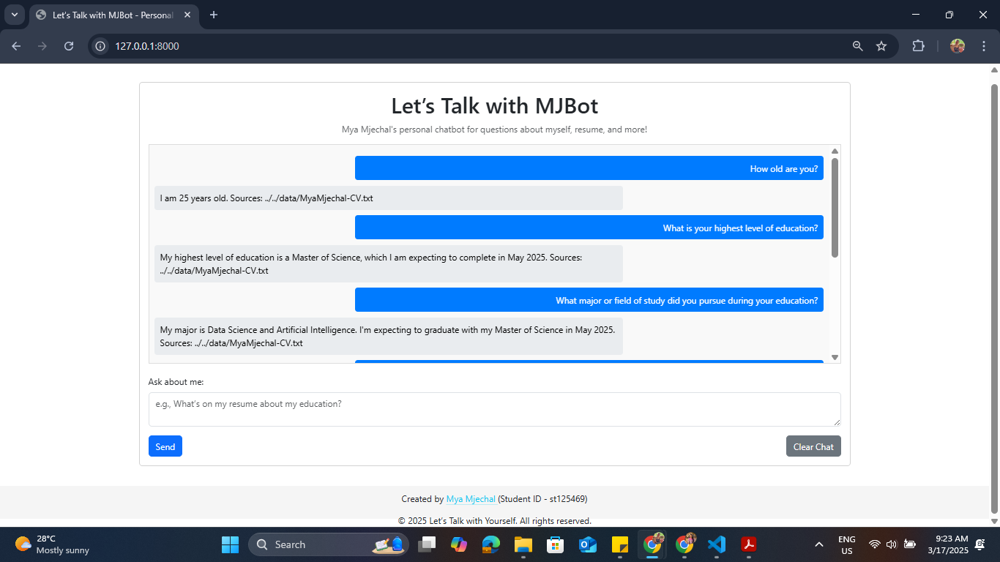

# A6: Let’s Talk with Yourself  

**AT82.05 Artificial Intelligence: Natural Language Understanding (NLU)**  
**Instructors:** Professor Chaklam Silpasuwanchai, Todsavad Tangtortan

## Table of Contents  
- [Student Information](#student-information)  
- [Project Overview](#project-overview)  
- [Tasks](#tasks)  
  - [Task 1: Source Discovery](#task-1-source-discovery)  
  - [Task 2: Analysis and Problem Solving](#task-2-analysis-and-problem-solving)  
  - [Task 3: Chatbot Development - Web Application](#task-3-chatbot-development---web-application)  
- [Installation Setup](#installation-setup)  
- [Usage](#usage)  
- [Demo and Screenshots](#demo-and-screenshots)  
- [References](#references)  

## Student Information  
- **Name:** Mya Mjechal
- **Student ID:** st125469
- **Major:** AIT - Data Science and Artificial Intelligence (DSAI)
- **Course:** AT82.05 Artificial Intelligence: Natural Language Understanding (NLU)  
- **Assignment:** A6: Let’s Talk with Yourself

## Project Overview  

This project implements **Retrieval-Augmented Generation (RAG)** using the **LangChain framework** to create a chatbot named **MJBot**. The chatbot is designed to answer questions about myself based on personal data, such as my CV, resume, and other relevant documents. It leverages RAG to retrieve information from these sources and generate coherent, context-aware responses. The project includes a Jupyter notebook for development and a web application to demonstrate the chatbot's functionality interactively.  

The project is divided into three main tasks:  

1. **Source Discovery** – Collecting personal data sources and designing a prompt template for the chatbot.  
2. **Analysis and Problem Solving** – Evaluating retriever and generator models used in RAG and addressing potential issues.  
3. **Chatbot Development - Web Application** – Building a web app with a chat interface to showcase the chatbot’s capabilities.  

The chatbot is capable of answering accurate results beyond the predefined 10 questions(listed in Task 3), with responses saved in a JSON file as part of the deliverables, leveraging personal data (CV) and LLM capabilities.

## Tasks

### Task 1: Source Discovery
- **Objective:** Gather relevant personal data and design a prompt for the chatbot.
- **Sources Used:**
  - **[MyaMjechal-CV.txt](https://github.com/MyaMjechal/nlp-a6-lets-talk-with-yourself-rag-chatbot/blob/main/data/MyaMjechal-CV.txt)** – A text file containing my resume with details about education, work experience, skills, and personal information.
  - **Reference Document:** The CV is the primary source loaded using `TextLoader` from LangChain.
- **Prompt Design:**
  - Created a custom prompt template for MJBot to provide friendly, accurate, and gentle responses based on my personal data.  
  - Example Prompt:  
    ```plaintext
    I'm your friendly NLP chatbot named MJBot, here to answer questions about Mya Mjechal myself based on my knowledge from my CV and personal data.
    The current year is 2025, and all answers should reflect this year unless otherwise specified.
    Whether you're curious about my education, work experience, or personal interests,
    I’ll provide accurate and gentle responses using the information I have.
    If I don't know something, I'll let you know kindly. Just let me know what you're wondering about, and I'll do my best to guide you through it!
    {context}
    Question: {question}
    Answer:
    ```  
- **Text-Generation Model Exploration:**  
  - Explored various text-generation models, including the default setup in the provided notebook and alternatives like **LLaMA3-70B** from Groq and **gemma-2-9b** from HuggingFace. 
  - Ultimately used **gemma2-9b-it** via `ChatGroq` due to its compatibility with my setup and available resources. This choice avoided package conflicts encountered with other models (e.g., Hugging Face’s `gemma-2-9b`) and leveraged Groq’s efficient API for fast inference within my resource constraints.

### Task 2: Analysis and Problem Solving  
#### 1. List of Retriever and Generator Models Utilized  
- **Retriever Model:**  
  - **Model:** `all-MiniLM-L6-v2` from Sentence Transformers.  
  - **Vector Store:** Paired with `faiss-cpu` (version 1.7.4) for efficient storage and retrieval of text embeddings.  
  - **Description:** Used to embed and retrieve relevant chunks from my CV based on semantic similarity.  
- **Generator Model:**  
  - **Model:** `gemma2-9b-it` accessed via `ChatGroq`.  
  - **Description:** A 9-billion parameter, instruction-tuned model from Groq’s API, used to generate coherent and context-aware responses based on retrieved CV data.  

#### 2. Analysis of Issues Related to Models Providing Unrelated Information
- **Retriever Issues (`all-MiniLM-L6-v2` with FAISS):**  
  - No significant issues were observed with the retriever. It consistently retrieved relevant chunks from my CV for the supported questions (e.g., asking "What skills do you have?" accurately pulled sections listing technical skills like "Python, JavaScript").
  - **Observation:** The lightweight design of `all-MiniLM-L6-v2` proved efficient and effective for my small dataset, delivering precise context for the generator. Its general-purpose embeddings worked well without requiring fine-tuning, likely due to the clear structure of my CV. 

- **Generator Issues (`gemma2-9b-it`):**  
  - **Date-Related Issue:** Due to the prompt specifying "The current year is 2025, and all answers should reflect this year unless otherwise specified," the generator forced all dates to align with 2025, leading to inaccuracies. For example:  
    - My birth year (1999) was correctly reflected as "25 years old in 2025," but education milestones (e.g., "Will graduate on May 2026") were incorrectly shifted or interpreted as 2025-related, distorting my timeline.  
  - **Cause:** The strict 2025 constraint in the prompt overrode the actual dates in my CV, and `gemma2-9b-it` prioritized the prompt’s instruction over the retrieved data’s factual accuracy.  
  - **Mitigation:**  
    - Refined the prompt to clarify that only the current context (e.g., age, current role) should reflect 2025, while historical dates should remain as in the CV. However, this adjustment was limited by the model’s tendency to overgeneralize based on the prompt.  
    - A more robust solution (not implemented due to resource limits) would involve preprocessing the CV to tag dates explicitly or fine-tuning the generator to distinguish between current and historical data.

- **General Observations:**  
  - Limited computational resources restricted extensive testing of alternative models or configurations, so I relied on the efficient `all-MiniLM-L6-v2` and Groq’s API for `gemma2-9b-it`.  
  - The combination worked well for most questions but highlighted the need for better context precision in both retrieval and generation stages to avoid unrelated or inaccurate outputs.

### Task 3: Chatbot Development - Web Application  
- **Objective:** Develop a web app showcasing MJBot with a chat interface.  
- **Features:**  
  - A text input box for users to type questions.
  - Displays MJBot’s generated responses based on retrieved CV data.  
  - Provides source context (e.g., CV excerpts) alongside answers where applicable.  
  - **Persistent Chat History:** Maintains conversation history in the browser using **localStorage**, surviving page refreshes until manually cleared (Clear Chat button).
  - **Chatbot-Style Display:** Appends user messages (right-aligned, blue) and MJBot responses (left-aligned, gray) to the chat container, including sources.
  - **Broad Question Support:** Capable of providing accurate results beyond the predefined 10 questions, leveraging CV data and LLM capabilities.
- **Technologies Used:**  
  - **Backend:** Flask, LangChain, PyTorch, Transformers
  - **Frontend:** HTML, Bootstrap
- **Supported Sample Questions:** MJBot can answer the following 10 questions and more:
  1. How old are you?  
  2. What is your highest level of education?  
  3. What major or field of study did you pursue during your education?  
  4. How many years of work experience do you have?  
  5. What type of work or industry have you been involved in?  
  6. Can you describe your current role or job responsibilities?  
  7. What are your core beliefs regarding the role of technology in shaping society?  
  8. How do you think cultural values should influence technological advancements?  
  9. As a master’s student, what is the most challenging aspect of your studies so far?  
  10. What specific research interests or academic goals do you hope to achieve during your time as a master’s student?  
- **Sample JSON Output ([qa_pairs.json](https://github.com/MyaMjechal/nlp-a6-lets-talk-with-yourself-rag-chatbot/blob/main/qa_pairs.json)):**
  ```json
  [
    {
      "question": "How old are you?",
      "answer": "As of 2025, I am 25 years old."
    },
    {
      "question": "What is your highest level of education?",
      "answer": "My highest level of education will be a Master of Science in Data Science and Artificial Intelligence, expected in May 2025 from the Asian Institute of Technology."
    },
  ]
  ```

## Installation Setup  

1. **Clone the Repository:**  
   ```bash
   git clone https://github.com/MyaMjechal/nlp-a6-lets-talk-with-yourself.git
   cd nlp-a6-lets-talk-with-yourself
   ```  
2. **Environment Setup:**  
   - Navigate to the web application folder:  
     ```bash
     cd app/code
     ```  
   - Install dependencies:  
     ```bash
     pip install -r requirements.txt
     ```  
   - Create `.env` file and put `GROQ_API_KEY`
     ```bash
     GROQ_API_KEY='API_KEY'
     ```
3. **Run the Web Application:**  
   - Start the Flask server:  
     ```bash
     python app.py
     ```  
   - Open your browser and navigate to [http://localhost:8000](http://localhost:8000).  

## Usage  

Once the web application is running:  
1. Open [http://localhost:8000](http://localhost:8000) in your browser.
2. Type a question from the supported list (or any related query) into the input box.
3. Click "Send" to receive MJBot’s response, along with relevant context from my CV where applicable.

## Demo and Screenshots  

### Demo GIF  

_GIF 1: Demonstration of MJBot answering questions about Mya Mjechal in the web application._  

### Screenshots  
**Web App Interface:**  

_Figure 1: Initial web interface of MJBot._  

**Sample Response:**  

_Figure 2: MJBot’s response to Sample Questions with context from CV interactively._  

## References  
- [LangChain Documentation](https://python.langchain.com/docs/get_started/introduction)  
- [RAG with LangChain](https://python.langchain.com/docs/integrations/chat/groq/)  
- [Sentence Transformers](https://huggingface.co/sentence-transformers)  
- [FAISS Documentation](https://github.com/facebookresearch/faiss/wiki)  
